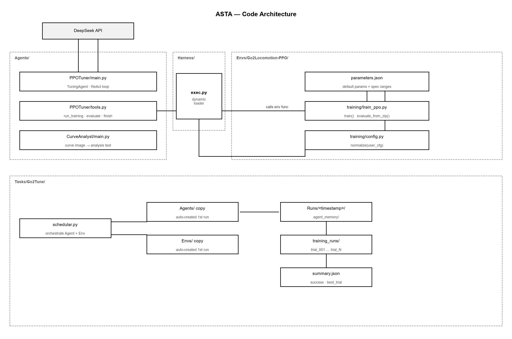

# 架构总览

## 设计目标

> 🚧 待填充：可扩展为「多 Agent / 多 Env / 多 Task」的通用框架；
> Agent 与 Env 解耦，新增任务不改核心循环。

## 组件图

> 🚧 待填充：各层职责与调用关系。Agent 通过 Harness 调用 Env，Task 的 schedular 负责编排。

## 运行逻辑

> 🚧 待填充：一次完整调参运行的控制流，从任务启动到目标达成。

## 数据流（一次 trial）

> 🚧 待填充：8 步流程（来自架构文档 §4）——
> LLM 输出 run_training → config.normalize 校验 → 训练落盘 → summary 回传 →
> CurveAnalyst 分析曲线 → reflection 写长期记忆 → 短期记忆追加 → 预算/goal_met 检查。
