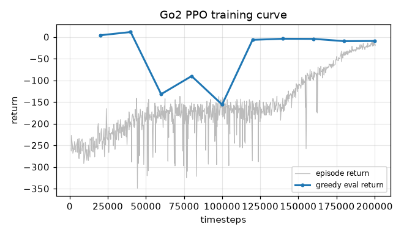
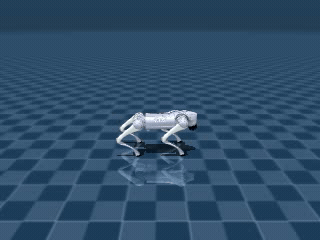
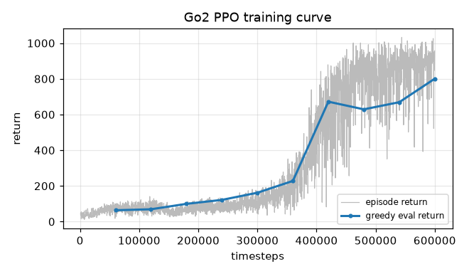
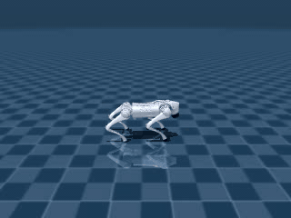
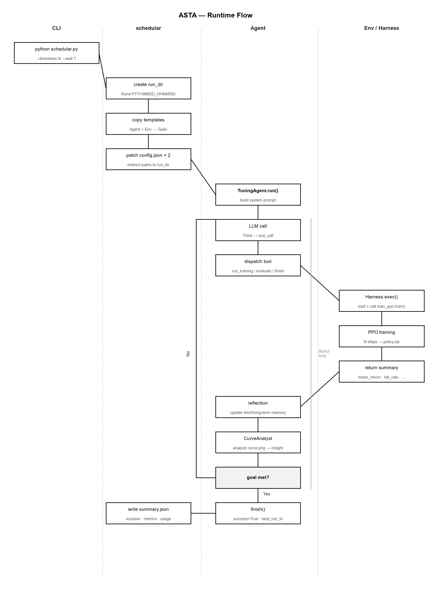

[中文文档](Docs/README.zh.md)

# Auto Simulation Training Agent (ASTA)

An agentic framework for autonomous robot training in simulation, built on MuJoCo.
Supports arbitrary robot environments and training configurations.


## Features

Once configured and launched, ASTA autonomously analyzes experiment results and adjusts
hyperparameters until the training goal is reached.


## Demo

In this example, we use a digital twin of the Unitree Go2 quadruped in a MuJoCo
environment, with the training goal of walking forward at 1 m/s.

ASTA analyzes multi-modal experiment outputs (charts, logs, etc.), tunes training
configurations, and achieves the goal in **6 trials** under a budget of at most
200,000 simulation steps per trial. Total API cost: ¥0.12 (DeepSeek API).


### Trial 1 vs Trial 6 (best)

Comparison of the first and final trials from run `Tasks/Go2Tune/Runs/20261003_183952`.

| Trial | Reward curve | Rollout |
| :---: | :---: | :---: |
| **Trial 1** |  |  |
| **Trial 6** |  |  |

The agent tuned three parameters — `kp=80, kd=2.0, action_scale=0.5` — lifting
mean return from −10 to 129, reducing velocity error from 1.0 to 0.18, and
bringing the fall rate to 0.


## Architecture

### Code layout

Each layer's responsibilities and call relationships. The Agent calls the Env
exclusively through the Harness; the Task's `schedular.py` wires them together
and manages run artifacts.


### Runtime flow

End-to-end control flow from CLI invocation to the training goal being reached.




## Quick Start

### Setup

```bash
pip install -r requirements.txt

# Configure API key (either method)
#   a. Copy .env.example to .env and fill in your key
#   b. Export as an environment variable
export DEEPSEEK_API_KEY=sk-...
cp .env.example .env
```

### Run the agent

Launch a Task — the agent will autonomously loop through
train → analyze → tune → retrain until the goal is met:

```bash
python Tasks/Go2Tune/schedular.py
```

All run artifacts (agent memory, env observations, per-trial configs and results, logs)
land under `Tasks/Go2Tune/Runs/YYYYMMDD_HHMMSS/`. The folder name is the run start time.
`summary.json` records success status, the best trial, and the final metrics.

Optional flags:
- `--no-viz` — skip post-training rollout rendering
- `--wall SECONDS` — total wall-clock budget
- `--timesteps N` — per-trial training step budget

```bash
python Envs/Go2Locomotion-PPO/training/train_ppo.py \
    --out runs/demo --timesteps 200000
```

---

### Custom tasks and environments

The project is organized in three layers: **Env / Agent / Task**.
A Task's `schedular.py` wires one or more Agents and Envs for a single autonomous
tuning run. All communication between Agents and Envs goes exclusively through
`Harness/exec.py`.

---

#### Add a new Env

Create a directory under `Envs/` following this layout:

```
Envs/MyEnv-PPO/
├── config.json          # path config, overwritten by schedular at runtime
├── parameters.json      # {"parameters": {...}, "spec": {key: {min, max}}}
├── env/                 # simulation assets and dynamics
├── training/            # training algorithm implementation
│   ├── config.py
│   └── train_ppo.py
├── observation/         # API the Env exposes to the Agent for observations
│   ├── README.md
│   └── metrics.py
└── action/              # API the Env exposes to the Agent for configuration
    ├── README.md
    └── configure.py     # reset_params / get_param_spec
```

---

#### Add a new Task (reuse existing Env + Agent — most common)

1. Copy `Tasks/Go2Tune/` to a new directory (e.g. `Tasks/MyTune/`)

2. Edit `schedular.py`:

| Field | Description |
|-------|-------------|
| `task_name` | Identifier used in long-term memory and logs |
| `goals` | Success criteria, e.g. `{"mean_lin_vel_error_max": 0.25, "fall_rate_max": 0.2}` |
| `default_timesteps` | Default per-trial training step budget |
| `start_config` | Initial training configuration |

3. Copy the Agent and Env you want to use into the Task directory

4. Run:
```bash
python Tasks/MyTune/schedular.py
```

The current implementation targets training the Unitree Go2 to walk forward at a
specific speed. You can create new Envs, Agents, and Tasks to fit your own goals.
